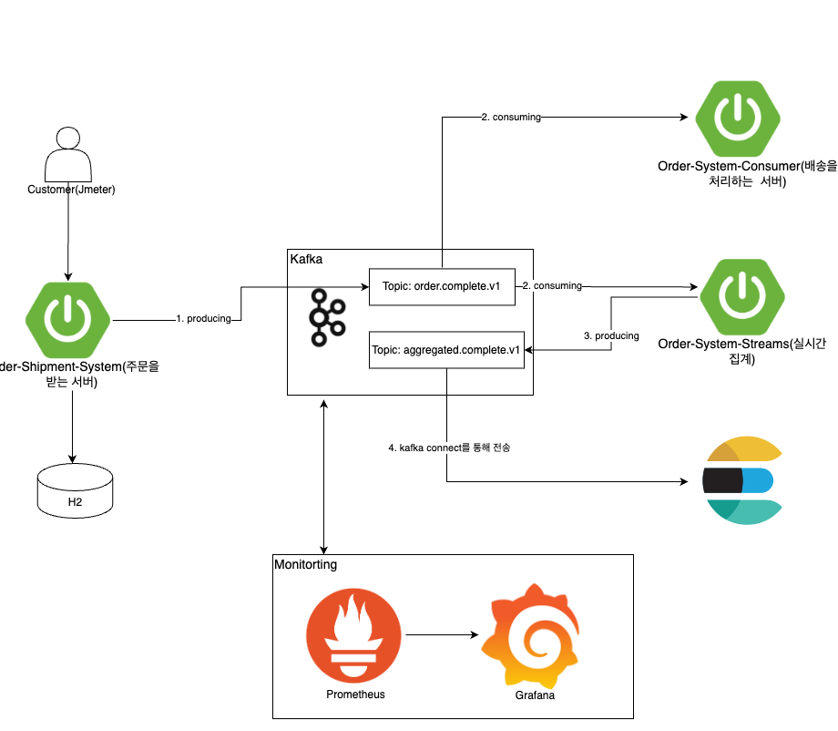

# Pub/Sub 구조로 개선한 ecommerce system
- 기술 스택
  - 
    - SpringBoot
    - Docker-compose
    - H2
    - Kafka
    - Kafka Streams
    - Elasticsearch

- 컴포넌트 설명
  - 
  - order-system-producer
    - 주문을 처리하는 서버
  - order-system-consumer
    - 배송을 담당하는 서버
  - order-system-streams
    - 실시간으로 제품별 합산 금액을 계산하여 특정 토픽에 메시지를 발행하는 서버
- 아키텍처
  - 
    
